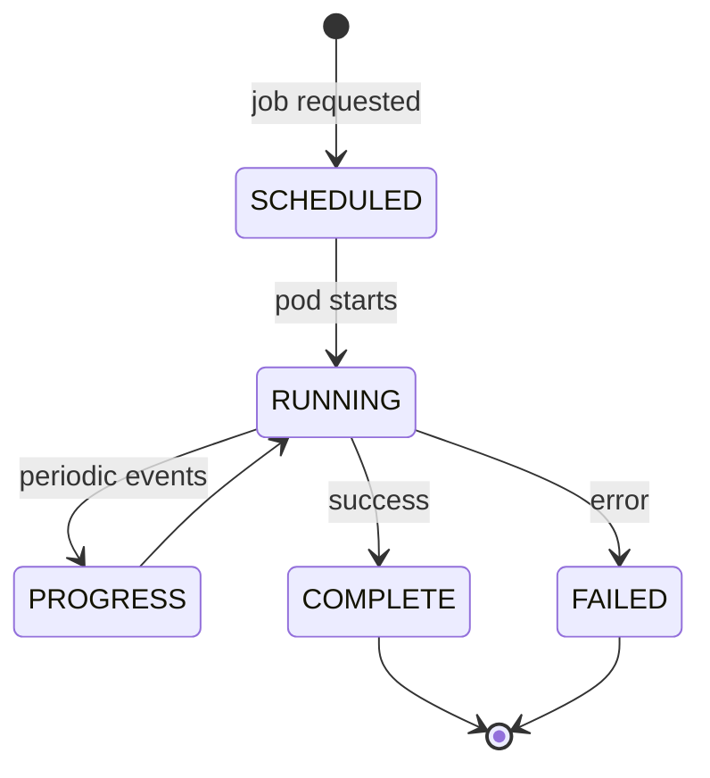

# dq-made-easy — Backend API and DQ-Job Split

**Status**: Draft  
**Date**: 2026-08-06

Defines which `dq-made-easy` workloads are long-lived services (MaaS registration) versus ephemeral jobs (no MaaS registration).

## The split

| Category | Services | workload-kind | MaaS register | Pod lifecycle |
|---|---|---|---|---|
| **Long-lived services** | `dq-api`, `dq-ui`, `dq-engine` | `service` | `true` | Deployment (always-on) |
| **Ephemeral jobs** | Spark jobs, profiling workers, Airflow DAGs | `job` | `false` | Job / CronJob (run to completion) |

## Long-lived services (register with MaaS)

### `dq-api`

- **What**: FastAPI backend — the main entry point for DQ data and orchestration.
- **Image**: `dq-api/Dockerfile.fastapi`
- **Registration**: On pod start, calls MaaS register endpoint with `service_name: dq-api`, `target_id`, `environment`.
- **De-registration**: On `SIGTERM`, completes in-flight requests, calls MaaS de-register, exits.
- **Health**: Exposes `/health` endpoint — MaaS marks `DEGRADED` on consecutive failures.
- **Placement**: One Deployment per target, 1 replica in dev/test.

### `dq-ui`

- **What**: React SPA served by nginx — frontend for DQ operations.
- **Image**: `dq-ui/Dockerfile.frontend`
- **Registration**: On pod start, calls MaaS register endpoint with `service_name: dq-ui`, `target_id`, `environment`.
- **De-registration**: On `SIGTERM`, calls MaaS de-register, exits.
- **Health**: Exposes `/healthz` endpoint — MaaS marks `DEGRADED` on consecutive failures.
- **Placement**: One Deployment per target, 1 replica in dev/test.

### `dq-engine`

- **What**: Spark engine with REST API — submits and manages DQ jobs.
- **Image**: `dq-engine/Dockerfile.engine`
- **Registration**: On pod start, calls MaaS register endpoint with `service_name: dq-engine`, `target_id`, `environment`.
- **De-registration**: On `SIGTERM`, drains in-flight job submissions, calls MaaS de-register, exits.
- **Health**: Exposes `/docs` (OpenAPI) as health probe — MaaS marks `DEGRADED` on consecutive failures.
- **Placement**: One Deployment per target, 1 replica in dev/test.

### Registration instance naming

Each long-lived service registers its instance as:
```
<service_name>-<target_id>-<replica_index>
```

Examples for dev:
```
dq-api-DEV-LOCAL-0
dq-ui-DEV-LOCAL-0
dq-engine-DEV-LOCAL-0
```

## Ephemeral jobs (no MaaS registration)

### Spark jobs

- **What**: Ephemeral Spark executors spawned by `dq-engine` to process DQ jobs.
- **workload-kind**: `job`
- **MaaS register**: `false`
- **Lifecycle**: Created by `dq-engine` on demand, runs to completion or failure, pod terminates.
- **Telemetry**: Emits `job.runner.*` events to observability pipeline (start, progress, complete, failure).
- **Visibility**: Tracked via telemetry aggregation, not MaaS service discovery.

### Profiling workers

- **What**: Workers consuming Redis queues (profiling, GX execution, GX join-pair materialization).
- **workload-kind**: `job`
- **MaaS register**: `false`
- **Lifecycle**: Spawned as needed by the API or engine, process queue items, terminate when idle.
- **Telemetry**: Emits `job.runner.*` events to observability pipeline.
- **Visibility**: Tracked via telemetry aggregation, not MaaS service discovery.

### Airflow DAGs

- **What**: Ephemeral tasks managed by platform Airflow for scheduled DQ operations.
- **workload-kind**: `job`
- **MaaS register**: `false`
- **Lifecycle**: Scheduled by Airflow, run to completion, pod terminates.
- **Telemetry**: Emits `job.runner.*` events to observability pipeline.
- **Visibility**: Tracked via telemetry aggregation and Airflow UI, not MaaS service discovery.

## Telemetry contract for ephemeral jobs

All ephemeral workloads emit the same telemetry event types defined in the [Platform Kubernetes Service Design](../../../../docs/infra/PLATFORM_KUBERNETES_SERVICE_DESIGN.md):

| Event | When emitted | Key fields |
|---|---|---|
| `job.runner.start` | Pod initialized, before processing | `job_id`, `runner_id`, `target_id`, `namespace`, `image_digest`, `job_type` |
| `job.runner.progress` | Every 60s or at stage boundaries | `job_id`, `runner_id`, `stage`, `records_processed`, `elapsed_s`, `cpu_usage`, `memory_usage_mb` |
| `job.runner.complete` | Job finished successfully | `job_id`, `runner_id`, `status`, `duration_s`, `records_total`, `cpu_peak`, `memory_peak_mb` |
| `job.runner.failure` | Job terminated with error | `job_id`, `runner_id`, `error_code`, `error_message`, `duration_s`, `records_processed`, `stage_at_failure` |

## Lifecycle diagram



## Kubernetes resource mapping

| Workload | K8s resource | Namespace | Strategy |
|---|---|---|---|
| `dq-api` | Deployment | `dq-dev` / `dq-test` | Always-on, 1 replica |
| `dq-ui` | Deployment | `dq-dev` / `dq-test` | Always-on, 1 replica |
| `dq-engine` | Deployment | `dq-dev` / `dq-test` | Always-on, 1 replica |
| Spark jobs | Job (dynamic) | `dq-dev` / `dq-test` | On-demand, created by engine |
| Profiling workers | Deployment or Job | `dq-dev` / `dq-test` | Queue-driven, variable replicas |
| Airflow DAGs | Job (CronJob) | `dq-dev` / `dq-test` | Scheduled by platform Airflow |

## Required labels and annotations (per workload)

### Long-lived services

```yaml
metadata:
  labels:
    platform.jaccloud.nl/managed-by: argocd
    platform.jaccloud.nl/environment: dev
    platform.jaccloud.nl/tenant: dq
    platform.jaccloud.nl/service: dq-api       # or dq-ui, dq-engine
    platform.jaccloud.nl/version: 0.1.0
    platform.jaccloud.nl/image-digest: sha256:...
  annotations:
    platform.jaccloud.nl/target-id: DEV-LOCAL
    platform.jaccloud.nl/workload-kind: service
    platform.jaccloud.nl/maas-register: "true"
    platform.jaccloud.nl/deployed-at-utc: 2026-08-06T00:00:00Z
```

### Ephemeral jobs

```yaml
metadata:
  labels:
    platform.jaccloud.nl/managed-by: argocd
    platform.jaccloud.nl/environment: dev
    platform.jaccloud.nl/tenant: dq
    platform.jaccloud.nl/service: dq-engine    # spawned by
    platform.jaccloud.nl/version: 0.1.0
  annotations:
    platform.jaccloud.nl/target-id: DEV-LOCAL
    platform.jaccloud.nl/workload-kind: job
    platform.jaccloud.nl/maas-register: "false"
    platform.jaccloud.nl/deployed-at-utc: 2026-08-06T00:00:00Z
```

## Decisions

1. **Three long-lived services**: `dq-api`, `dq-ui`, `dq-engine`. Everything else is ephemeral.
2. **No MaaS registration for jobs**: Jobs are observable via telemetry only. MaaS tracks discoverable services for routing and availability.
3. **Single replica in dev/test**: One pod per service per target. Production targets may scale up.
4. **Same image for engine and jobs**: Spark jobs and profiling workers reuse the `dq-engine` image with different entrypoints. This simplifies the image contract.
5. **Telemetry is mandatory for jobs**: Every job must emit `job.runner.start` and either `job.runner.complete` or `job.runner.failure`. No telemetry = no observability.
