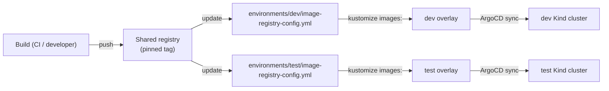

# Image Reference Contract

**Status**: Draft  
**Date**: 2026-08-06

Defines how consumer tenants receive pinned image tags from the shared registry and how they apply them in their Kustomize overlays.

## Registry layout

| Environment | Registry | Namespace |
|---|---|---|
| dev | `docker-registry.dev.jac.dot:5000` | `jacbeekers` |
| test | `docker-registry.jacloud.nl:5000` | `jacbeekers` |

## How consumers receive image references

### 1. Look up the pinned tag

Each environment has an `image-registry-config.yml` file in `environments/<env>/`:

```yaml
dq:
  api:
    image: "docker-registry.dev.jac.dot:5000/jacbeekers/dq-api"
    tag: "0.1.0"
  ui:
    image: "docker-registry.dev.jac.dot:5000/jacbeekers/dq-ui"
    tag: "0.1.0"
  engine:
    image: "docker-registry.dev.jac.dot:5000/jacbeekers/dq-engine"
    tag: "0.1.0"
```

Consumers read this file to find the current pinned tag for each image.

### 2. Apply via Kustomize `images:` patches

Consumer overlays use Kustomize `images:` to substitute their base deployment images:

```yaml
apiVersion: kustomize.config.k8s.io/v1beta1
kind: Kustomization

namespace: dq-dev
resources:
  - ../../base

# Substitute images from the shared registry
images:
  - name: dq-api:latest
    newName: docker-registry.dev.jac.dot:5000/jacbeekers/dq-api
    newTag: "0.1.0"
  - name: dq-ui:latest
    newName: docker-registry.dev.jac.dot:5000/jacbeekers/dq-ui
    newTag: "0.1.0"
  - name: dq-engine:latest
    newName: docker-registry.dev.jac.dot:5000/jacbeekers/dq-engine
    newTag: "0.1.0"
```

### 3. Platform images use the same mechanism

Platform overlays (Kong, Keycloak) follow the same pattern:

```yaml
# apps/platform/kong/overlays/dev/kustomization.yml
images:
  - name: kong:3.9
    newName: docker-registry.dev.jac.dot:5000/jacbeekers/platform-kong
    newTag: "0.1.0"
```

## Promotion flow



## Rules

1. **Build once, promote by reference**: Images are built once, pushed to the shared registry with a pinned tag (e.g. `0.1.0`). Both dev and test use the same tag.
2. **No per-environment rebuilds**: Environment-specific configuration is injected via ConfigMaps, Secrets, or Kustomize patches — never via different Dockerfiles.
3. **Tags are SemVer**: `MAJOR.MINOR.PATCH` (e.g. `0.1.0`). The `latest` tag is never used in production overlays.
4. **Image registry config is updated by pipeline**: When a new image is published, the platform pipeline updates `environments/<env>/image-registry-config.yml` with the new tag.
5. **Consumers update their overlays**: After the config file is updated, the consumer's Kustomize overlay `images:` patch is updated to reference the new tag.
6. **Rollback via ArgoCD**: ArgoCD revision rollback reverts to the previous manifest (and thus the previous image tag).

## Digest references (future)

For production-grade immutability, image references will eventually use SHA256 digests instead of tags:

```yaml
images:
  - name: dq-api:latest
    newName: docker-registry.dev.jac.dot:5000/jacbeekers/dq-api@sha256:abc123...
```

This is a future enhancement — the current Kind-based dev/test environments use pinned tags.

## Consumer example: dq-made-easy dev overlay

```yaml
# dq-made-easy/k8s/overlays/dev/kustomization.yml
apiVersion: kustomize.config.k8s.io/v1beta1
kind: Kustomization

namespace: dq-dev

resources:
  - ../../base

images:
  - name: dq-api:latest
    newName: docker-registry.dev.jac.dot:5000/jacbeekers/dq-api
    newTag: "0.1.0"
  - name: dq-ui:latest
    newName: docker-registry.dev.jac.dot:5000/jacbeekers/dq-ui
    newTag: "0.1.0"
  - name: dq-engine:latest
    newName: docker-registry.dev.jac.dot:5000/jacbeekers/dq-engine
    newTag: "0.1.0"

patches:
  - target:
      kind: Ingress
      name: dq-api
    patch: |
      - op: replace
        path: /spec/rules/0/host
        value: dq-api.dev.jac.dot
```

## Consumer example: metadata-as-a-service dev overlay

```yaml
# metadata-as-a-service/k8s/overlays/dev/kustomization.yml
apiVersion: kustomize.config.k8s.io/v1beta1
kind: Kustomization

namespace: maas-dev

resources:
  - ../../base

images:
  - name: maas-api:latest
    newName: docker-registry.dev.jac.dot:5000/jacbeekers/maas-api
    newTag: "0.1.0"
  - name: maas-coordinator:latest
    newName: docker-registry.dev.jac.dot:5000/jacbeekers/maas-coordinator
    newTag: "0.1.0"
  - name: maas-control-plane:latest
    newName: docker-registry.dev.jac.dot:5000/jacbeekers/maas-control-plane
    newTag: "0.1.0"
  - name: maas-central-repo:latest
    newName: docker-registry.dev.jac.dot:5000/jacbeekers/maas-central-repo
    newTag: "0.1.0"
  - name: maas-scenario-catalog:latest
    newName: docker-registry.dev.jac.dot:5000/jacbeekers/maas-scenario-catalog
    newTag: "0.1.0"
  - name: maas-orchestrator:latest
    newName: docker-registry.dev.jac.dot:5000/jacbeekers/maas-orchestrator
    newTag: "0.1.0"
  - name: maas-bff:latest
    newName: docker-registry.dev.jac.dot:5000/jacbeekers/maas-bff
    newTag: "0.1.0"
  - name: maas-web:latest
    newName: docker-registry.dev.jac.dot:5000/jacbeekers/maas-web
    newTag: "0.1.0"
```

## Registry access

Kind clusters pull images from the shared registry. For local dev:

```bash
# Load image into Kind (if registry is not available)
kind load docker-image docker-registry.dev.jac.dot:5000/jacbeekers/dq-api:0.1.0 --name platform-dev
```

For test (remote):

```bash
# Push to test registry, Kind pulls from it
docker push docker-registry.jacloud.nl:5000/jacbeekers/dq-api:0.1.0
```
